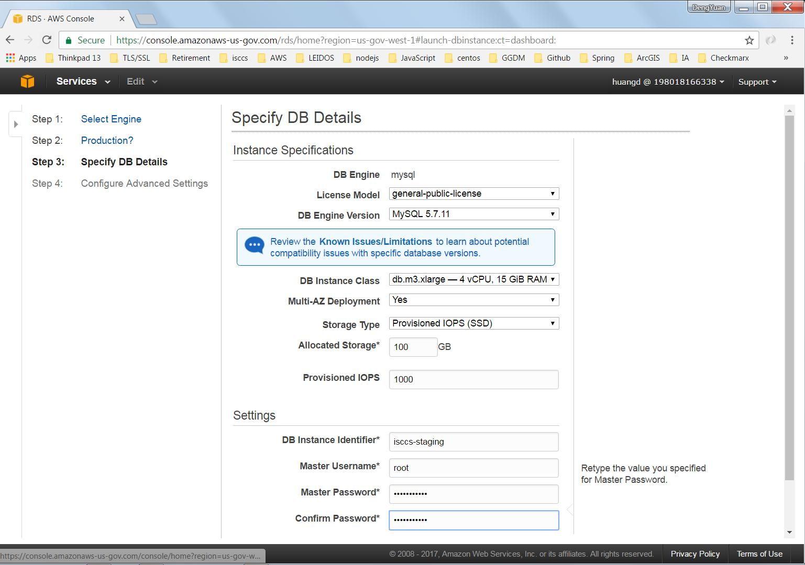
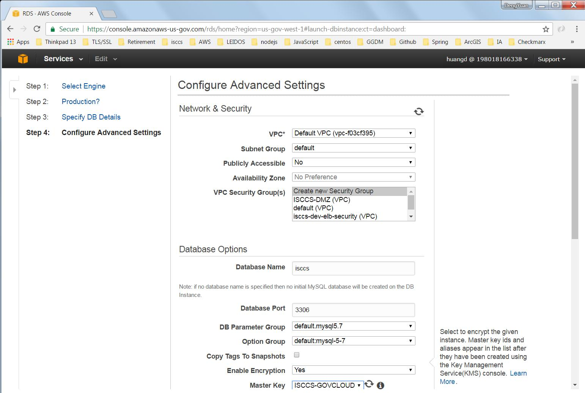
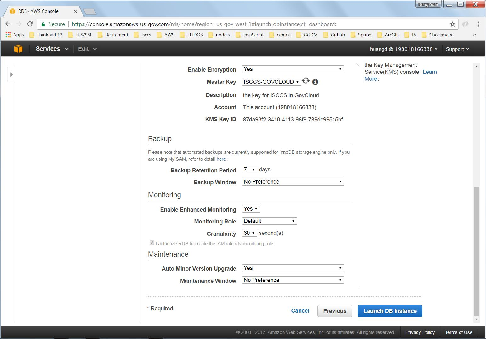

**MySQL RDS**

  Version: 5.7.11

**Staging Configuration Page 1**

**Staging Configuration Page 2**

**Install the MySQL client**
  * copy mysql57-community-release-el7-9.noarch.rpm to EC2's ec2-user/Downloads.
  * yum localinstall ~ec2-user/Downloads/mysql57-community-release-el7-9.noarch.rpm
  * yum install mysql

**Re-configure the MySQL RDS's inbound rule**
  * change the security group's inbound IP address to be the EC2's internal IP address.

**How to setup the isccs instance**
  * mysql -h MySQLRDS_IP -u root -p < /opt/isccs/ddl/isccs_creation.sql
  * modify the /opt/isccs/ddl/isccs_user_creation.sql to replace the localhost with the MySQLRDS_IP and the user isccs's password.
  * mysql -h MySQLRDS_IP -u root -p < /opt/isccs/ddl/isccs_user_creation.sql
  * mysql -h MySQLRDS_IP -u root -p < /opt/isccs/ddl/isccs_scratch_20170224.sql